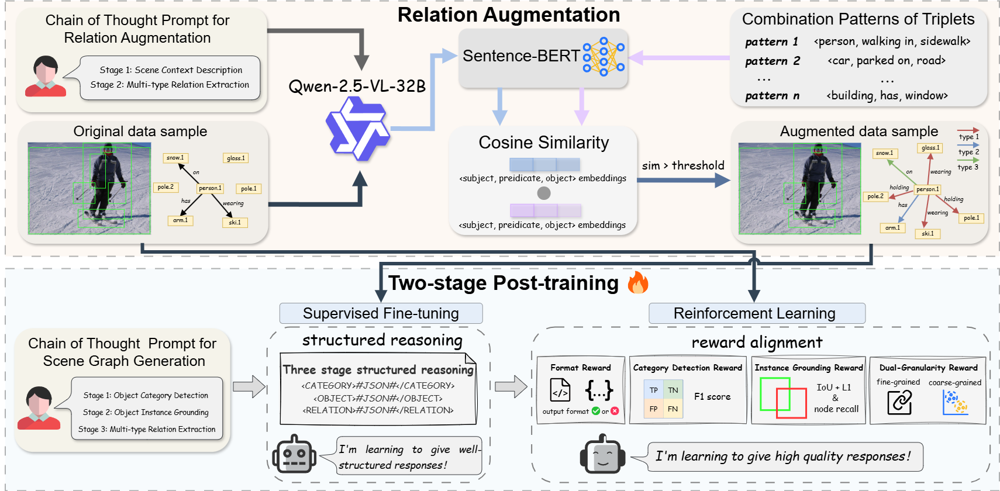
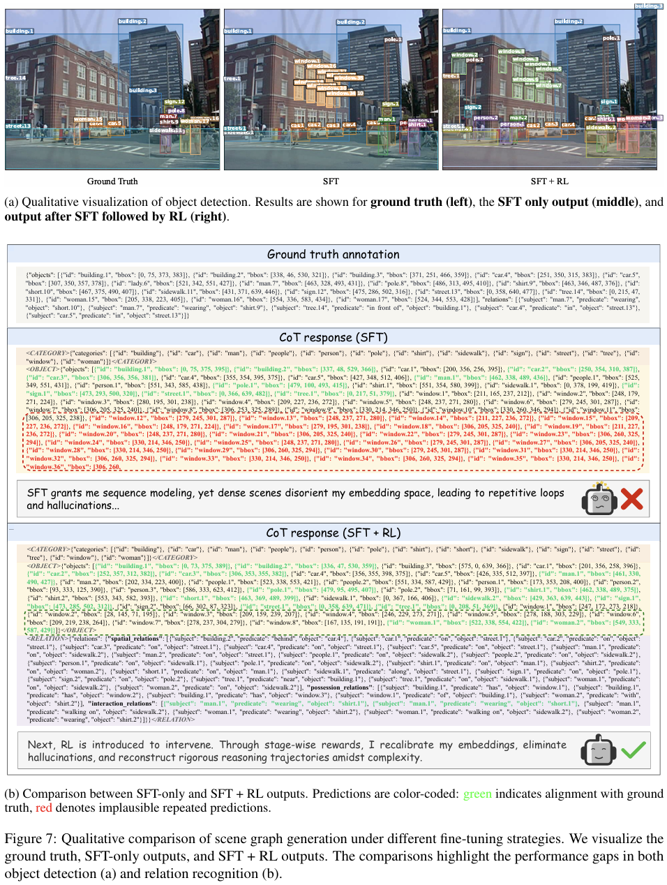

# SGG-R³: From Next-Token Prediction to End-to-End Unbiased Scene Graph Generation

[](LICENSE)
[](https://www.python.org/)
[](https://pytorch.org/)
[](https://arxiv.org/abs/2603.07961)

> **Official implementation of SGG-R3**, a structured reasoning framework for end-to-end unbiased scene graph generation. This work addresses the challenges of sparse, long-tailed relation distributions in Scene Graph Generation (SGG) by integrating task-specific chain-of-thought reasoning with reinforcement learning.

## 🔥 Highlights

- **Structured Three-Stage Reasoning**: Decomposes scene graph generation into sequential category detection, instance grounding, and multi-type relation extraction stages
- **Relation Augmentation**: Mitigates relation sparsity by generating high-quality augmented data using MLLM
- **Dual-granularity Reward**: Combines fine-grained and coarse-grained relation rewards to address long-tail distribution
- **Leading Performance**: Achieves superior results on VG150 and PSG benchmarks compared to existing methods


## 📊 Key Results

**Relationship Recognition Results (k=100)**

| Method | Dataset | Params | Recall | mRecall | zsRecall |
|--------|---------|--------|--------|---------|----------|
| SGG-R3 (SFT+RL) | VG150 | 3B | **36.0** | **14.8** | **6.1** |
| SGG-R3 (SFT+RL) | PSG | 3B | **52.5** | **44.3** | **7.7** |

**Object Recognition Results**

| Method | Params | VG150 (Recall) | VG150 (mRecall) | PSG (Recall) | PSG (mRecall) |
|--------|--------|---------------|---------------|------------|-------------|
| SGG-R3 (SFT) | 2B | 32.04 | 31.15 | 56.52 | 53.78 |
| SGG-R3 (SFT) | 3B | 34.12 | 33.24 | 56.50 | 53.46 |
| SGG-R3 (SFT+RL) | 3B | 50.07 | 47.57 | 61.32 | 59.27 |


## 🏗️ Framework Overview

SGG-R3 integrates supervised fine-tuning (SFT) and reinforcement learning (RL) with Group Sequence Policy Optimization (GSPO) in a three-stage structured reasoning framework:



```bash
Input Image
↓
Stage 1: Object Category Detection
↓
Stage 2: Object Instance Grounding
↓
Stage 3: Multi-type Relation Extraction
↓
Structured Scene Graph Output
```

## Visualization of SFT vs RL

